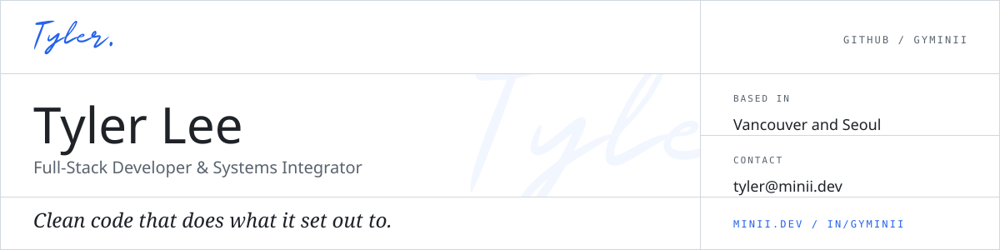

<a href="https://www.minii.dev/">
<picture>
  <source media="(prefers-color-scheme: dark)" srcset="./assets/card-dark.svg">
  
</picture>
</a>

<table width="100%">
  <tr>
    <td align="center" valign="middle" width="34%">
      <a href="https://www.minii.dev/">
        <picture>
          <source media="(prefers-color-scheme: dark)" srcset="./assets/icon-globe-dark.svg">
          
        </picture>
      </a>
    </td>
    <td align="center" valign="middle" width="33%">
      <a href="mailto:tyler@minii.dev">
        <picture>
          <source media="(prefers-color-scheme: dark)" srcset="./assets/icon-mail-dark.svg">
          
        </picture>
      </a>
    </td>
    <td align="center" valign="middle" width="33%">
      <a href="https://www.linkedin.com/in/gyminii/">
        <picture>
          <source media="(prefers-color-scheme: dark)" srcset="./assets/icon-linkedin-dark.svg">
          
        </picture>
      </a>
    </td>
  </tr>
</table>
